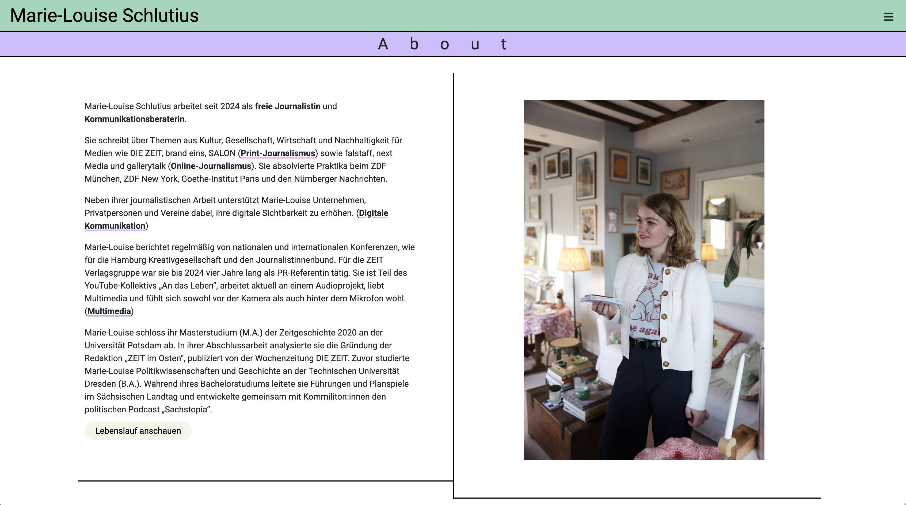
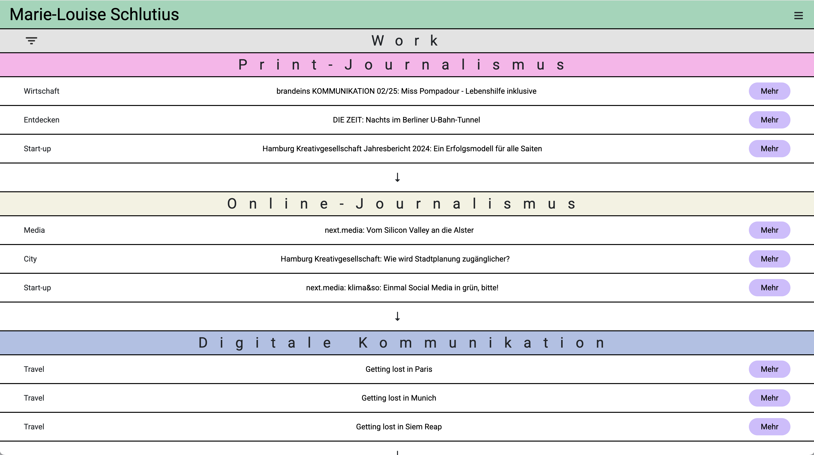

# ✨ Journalist Portfolio – Digital Communication & Multimedia  

🔗 **Live Demo:** [View the Website on Netlify](https://journalist-website.netlify.app/)  

## 🎨 Project Overview  

This website was built for a journalist working at the intersection of storytelling, digital communication, and multimedia. The goal was to reflect her experimental and colorful approach to work, while ensuring the site remains structured and easy to navigate.

The final site includes a vibrant homepage, an about page, and a dynamic works section with filters and category-based displays. Built with **Eleventy** and powered by **Decap CMS**, the site allows the client to easily manage and showcase her creative projects without touching code.

### Features:
- Colorful, experimental design tailored to a creative professional.
- Dynamic filtering system for exploring tagged work.
- Smooth CMS integration for easy content updates.
- Responsive, toggle-based display for articles by category.

---

## 🖼️ Screenshots  

### 🖥️ Desktop View  
    

---

## 🎯 Aims  
- Build a vibrant and expressive portfolio site that feels personal and intuitive.  
- Enable easy content management via **Decap CMS**.  
- Organise work into categories with expandable/collapsible sections.  
- Allow users to filter articles by tag.  
- Ensure responsive design and performance on all devices.  

---

## 🚧 Challenges & Solutions  

### 🧩 Combining Structure with Creative Design  
✅ **Solution:** Balanced experimental visuals with a clear navigation system and layout hierarchy using CSS Flexbox and animations.  

### 🔧 Integrating Decap CMS with Eleventy  
✅ **Solution:** Configured Decap CMS collections to align with Eleventy’s folder structure and markdown data. Used Eleventy shortcodes and filters for custom layouts.

### 🧭 Filtering by Tags Across Categories  
✅ **Solution:** Implemented a custom filter system with dropdown toggle using vanilla JavaScript, enabling cross-category article search via tags.  

### 🗂️ Expand/Collapse Category Sections  
✅ **Solution:** Used lightweight JavaScript to toggle visibility of article lists within each category, improving UX on both mobile and desktop.  

### 📱 Responsive Design for All Devices  
✅ **Solution:** Built a fully responsive layout using CSS Flexbox, tested extensively across devices and screen sizes.  

---

## 🛠 Tech Stack  

- **Static Site Generator:** [Eleventy (11ty)](https://www.11ty.dev/)  
- **CMS:** [Decap CMS](https://www.decapcms.org/)  
- **Hosting & Deployment:** [Netlify](https://www.netlify.com/)  
- **Styling:** CSS Grid, Flexbox, Custom Animations  
- **Languages:** HTML, CSS, JavaScript  

---

## 📞 Contact  

📧 **Email:** rohogarth@gmail.com 
🌐 **Portfolio:** [Portfolio](https://wondrous-sprite-d950e1.netlify.app/)  
💼 **LinkedIn:** [linkedin.com/in/yourname](https://www.linkedin.com/in/rosemary-hogarth/)  
