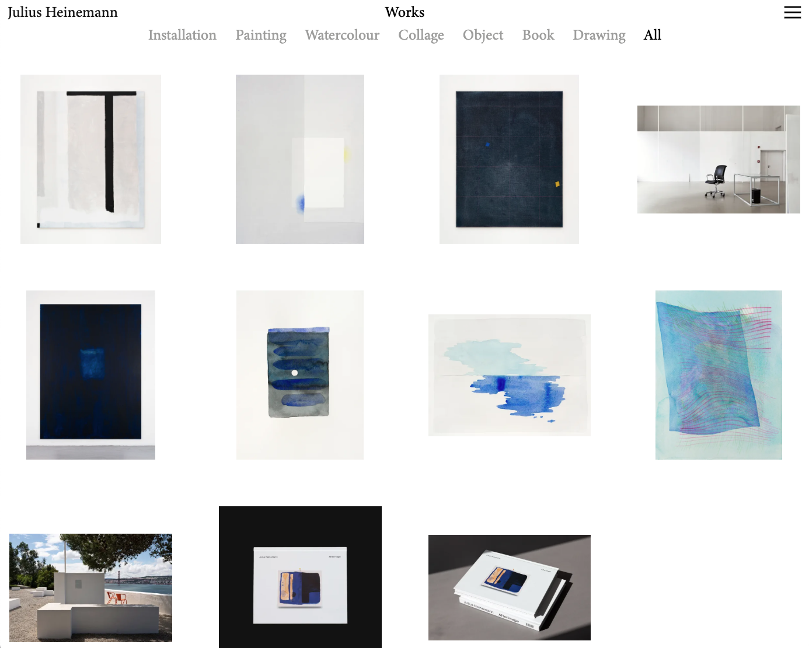
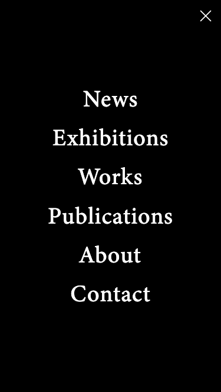
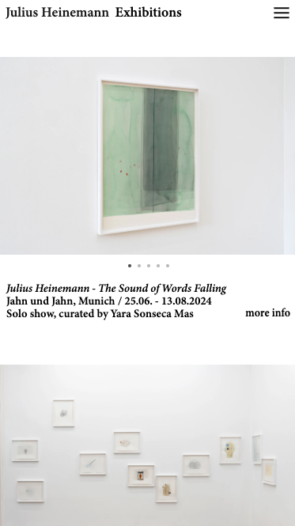
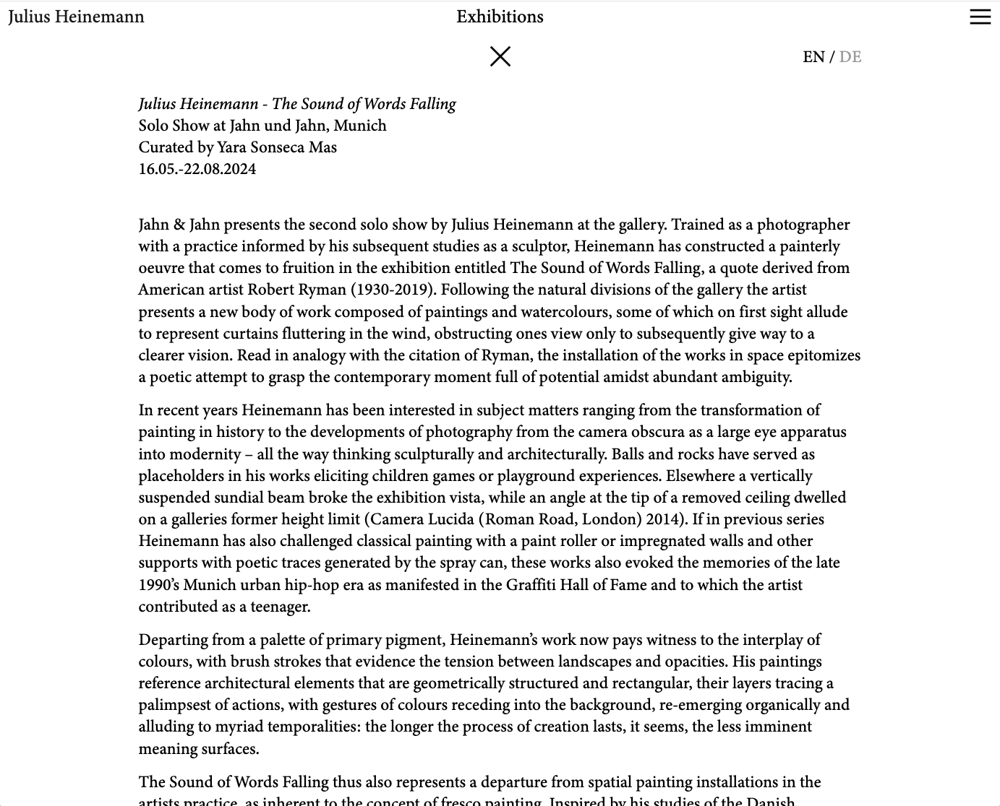
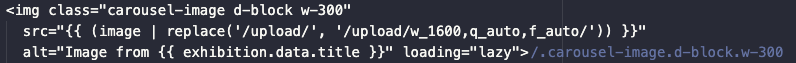
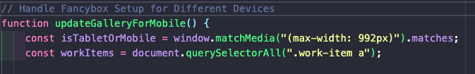
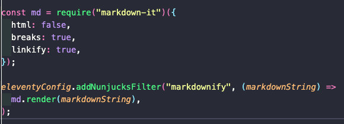

# Julius Heinemann Art – A Fast and Modern Static Website  

🔗 **Live Demo:** [View the Website on Netlify](https://your-netlify-link.netlify.app)  

## 🖼️ Project Overview  

This project was built for an artist seeking to showcase their work with a minimalistic, sleek design that reflects their artistic practice.  

To achieve this, I focused on dynamic image optimisation and an intuitive CMS in order to ensure the optimum viewing experience for visitors and ideal content management for the artist.  

Along the way, I tackled challenges such as:  
- Integrating Decap CMS with Eleventy** for smooth content updates.  
- Optimising images for multiple layouts, including full-screen views, thumbnails, and slideshows.  
- Streamlining deployment on Netlify for a fast and efficient workflow.  

## 📸 Screenshots  

### 🖥️ Desktop View  

  

### 📱 Mobile View  

     

### 🌍 Multi-Language Support  
  

## 🎯 Aims  
- Build a fast, lightweight, and responsive website with a headless CMS.  
- Enable smooth content management via Decap CMS.  
- Optimise images dynamically using Cloudinary to improve performance.  
- Implement a filter system for artworks, each with its own slideshow.  
- Support multiple languages for accessibility and international reach.  

## 🛠️ Challenges & Solutions  

### 💻 Integrating Decap CMS with Eleventy while maintaining a smooth build process  
✅ **Solution:** Configured a Git-based workflow and used Eleventy’s collections to pull structured data.  

### 💻 Optimising large images without slowing down performance  
✅ **Solution:** Implemented Cloudinary's API to serve responsive, auto-optimised images.   
-  

### 💻 Keeping the Site Fully Responsive with Different Layouts for Desktop & Mobile  
✅ **Solution:** Used **CSS Grid & Flexbox** to create distinct layouts, ensuring a seamless experience across devices.  

### 💻 Adding & Removing Slideshows Based on Screen Size  
✅ **Solution:**  
- Used **Fancybox (or Bootstrap)** for feature-rich slideshows on desktop.  
- Used a **CSS snap-based slideshow** for mobile to keep it lightweight.  
- Implemented **JavaScript screen-size detection** to load the right slideshow dynamically.
-  

### 💻 Custom Eleventy Filters for Markdown Formatting  
✅ **Solution:** Researched and implemented **custom Eleventy filters** to properly parse and format Markdown, ensuring clean and readable content output. 
-  

### 💻 Implementing a Filter System for Artworks (Each with Its Own Slideshow)  
✅ **Solution:**  
- Built an **artwork categorisation system** in Eleventy.  
- Used **JavaScript, Eleventy collections & Fancybox data attributes** to filter artworks dynamically.  
- Integrated **custom slideshow logic** for each category.  

### 💻 Implementing Multi-Language Support in Decap CMS & Eleventy  
✅ **Solution:**  
- Configured **Decap CMS** to support multiple language options for text fields.  
- Added a **language toggle** on text pages, allowing users to switch easily between languages.  
- Used **Eleventy’s template structure** to dynamically load the correct language version.  

### 💻 Managing deployment and automated builds with Netlify  
✅ **Solution:** Set up continuous deployment with Netlify. 

## 🛠 Tech Stack  

- **Framework:** [Eleventy (11ty)](https://www.11ty.dev/)  
- **CMS:** [Decap CMS](https://www.decapcms.org/)  
- **Hosting:** [Netlify](https://www.netlify.com/)  
- **Image Optimisation:** [Cloudinary](https://cloudinary.com/)  
- **Slideshow Libraries:** Fancybox, Bootstrap, CSS Snap Scroll  
- **Styling:** CSS Grid, Flexbox  
- **Languages:** HTML, CSS, JavaScript  

## 📞 Contact  

📧 **Email:** rohogarth@email.com  
🔗 **Portfolio:** [https://wondrous-sprite-d950e1.netlify.app/](https://wondrous-sprite-d950e1.netlify.app/)  
💼 **LinkedIn:** [https://www.linkedin.com/in/rosemary-hogarth/](https://www.linkedin.com/in/rosemary-hogarth/)  
